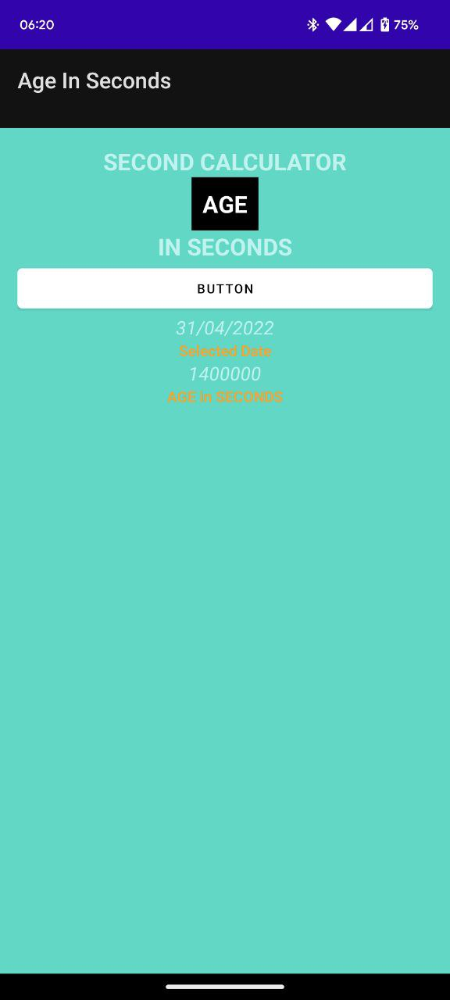
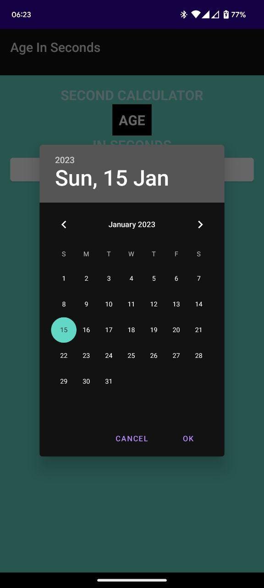
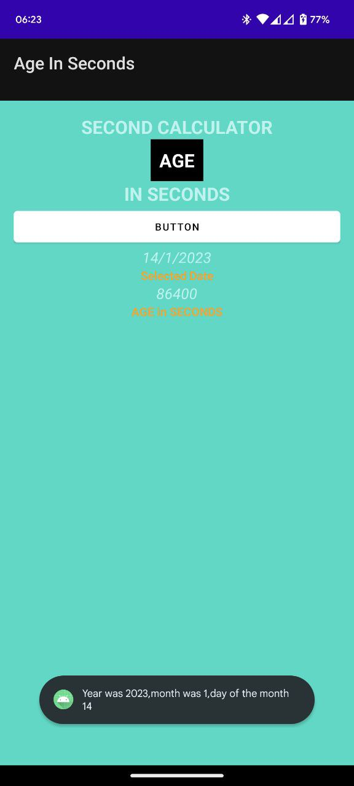

# Age-Calculator-In-Seconds
Basic App for calculating your age in seconds

# Details

## Used the Date picker dialog

* Took out the time component of the data picker dialog

* The time compoment is in miliseconds converted it to seconds and then displayed it to user

Language used KOTLIN

# UI of the APP

## Date Picker Dialog

## Output

